# SCWT

**SCWT — Smart Campus Waste Transformation.**
A standalone campus waste-sorting product built around a **Carriage-based
sorting station**: a carriage travels along a linear rail and releases
classified waste into the correct bin.

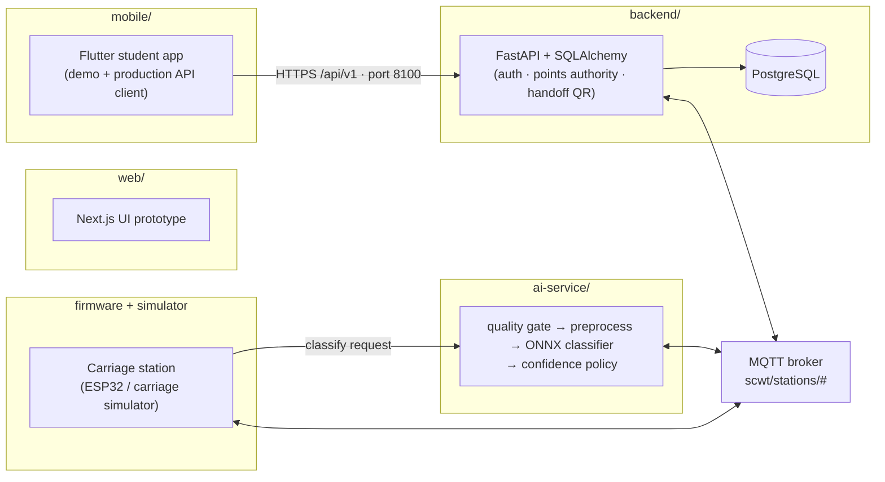

This repository contains the **entire product**: student app, web prototype,
backend, database schema, AI pipeline, MQTT infrastructure, carriage
simulator and firmware, tests, and end-to-end proofs. It runs with no
dependency on any other project's source or services.

## Key features

- **Carriage-based sorting** — the carriage travels a linear rail between the
  intake and the routed bin; the in-carriage load cell weighs each deposit
  naturally.
- **Points authority** — in production the client never computes points;
  balances and history come exclusively from the backend.
- **Handoff QR** — deposit hand-off flow with QR verification.
- **Web prototype** — Next.js UI prototype of the student app experience.
- **End-to-end proof** — `scripts/e2e_carriage_chain.py` on the real stack.

## The Carriage mechanism

One station body, four compartments at fixed positions on a linear rail.
The carriage carries the deposited item from the intake to the routed bin:

```
ROUTE_TO compartment 2 → lookup rail position → stepper drives belt
→ limit-switch homing on boot → position confirmed → item released
→ in-carriage load cell weighs the deposit → deposit_result published
```

Trade-offs vs other sorting mechanisms: simplest motion control and manual
clearing, one moving axis, per-item weighing happens naturally inside the
carriage; worst-case travel is longer than a rotary chute of the same
footprint. Engineering notes: `docs/carriage-v1.md`.

## Tech stack

| Layer | Tech |
|---|---|
| Backend | FastAPI · SQLAlchemy · Alembic · PostgreSQL · paho-mqtt |
| AI service | FastAPI · ONNX Runtime · NumPy · SciPy · scikit-learn |
| Firmware | PlatformIO / ESP32 (`pio run -d firmware/carriage-v1`) |
| Mobile | Flutter (`mobile/scwt_flutter`) |
| Web | Next.js 16 · React 19 (`web/`) |
| Infra | docker-compose · authenticated Mosquitto broker |

## Layout

| Path | What |
|---|---|
| `mobile/` | Flutter student app (`scwt_flutter`; demo mode + production API client) |
| `web/` | Next.js UI prototype of the app experience |
| `backend/` | FastAPI + SQLAlchemy + Alembic; authentication, points authority, deposits, rewards, leaderboard, handoff QR |
| `ai-service/` | Station-side classifier (quality gate → preprocess → ONNX model → confidence policy) |
| `hardware-simulator/` | Carriage ESP32 simulator speaking the station MQTT contract |
| `firmware/carriage-v1/` | ESP32 firmware skeleton for the physical carriage station |
| `scripts/` | `e2e_carriage_chain.py` full-stack live proof · `dev_up.sh` / `dev_health.sh` real dev stack |
| `infra/` | docker-compose dev stack + authenticated mosquitto config (API 8100 · AI 8052 · MQTT 1886) |
| `docs/` | architecture, API contract, MQTT contract, mechanism notes, AI validation, hardware checklist |

## Screenshots

Next.js web prototype (`web/`) plus the Flutter app (`mobile/`):

| | |
|---|---|
| 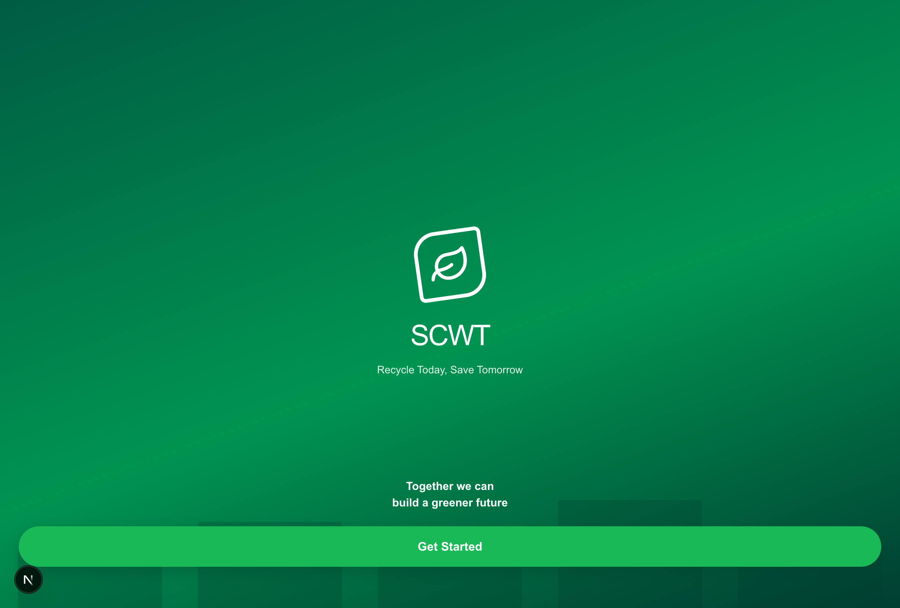 | 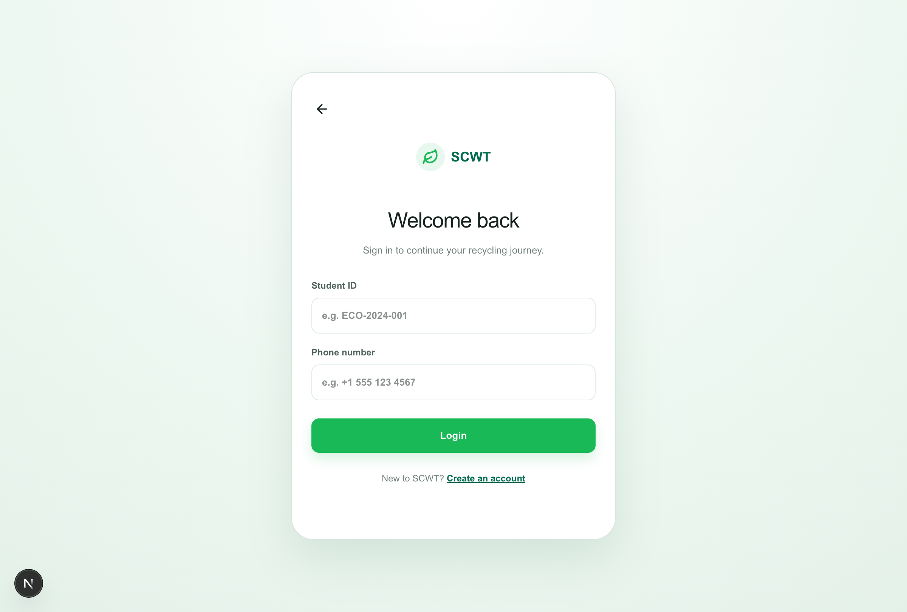 |
| 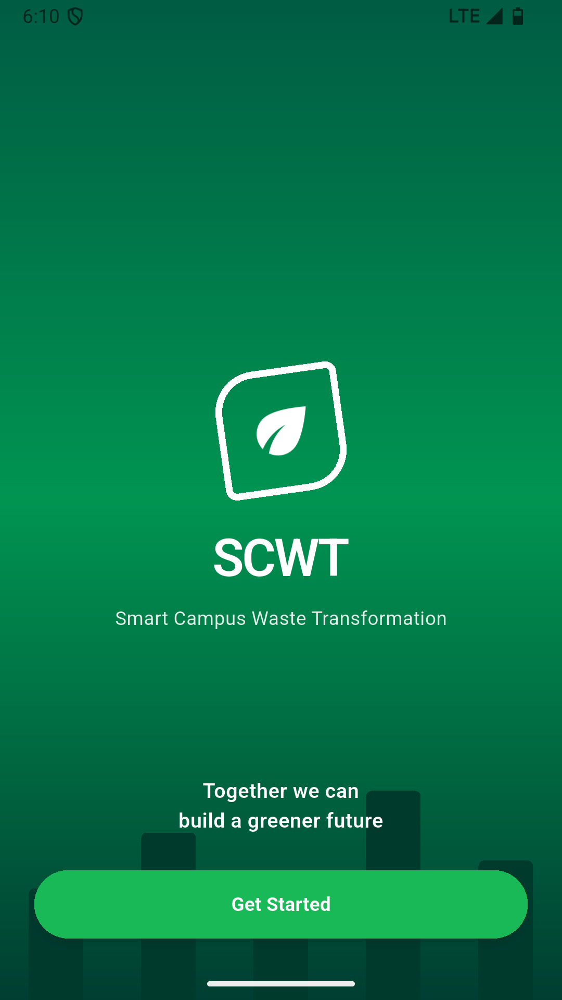 | 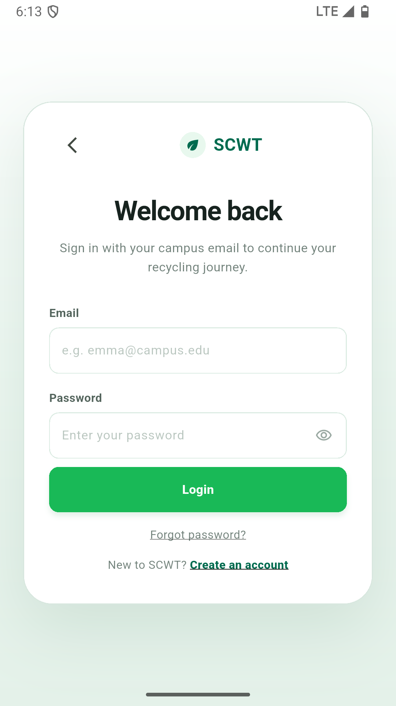 |
| 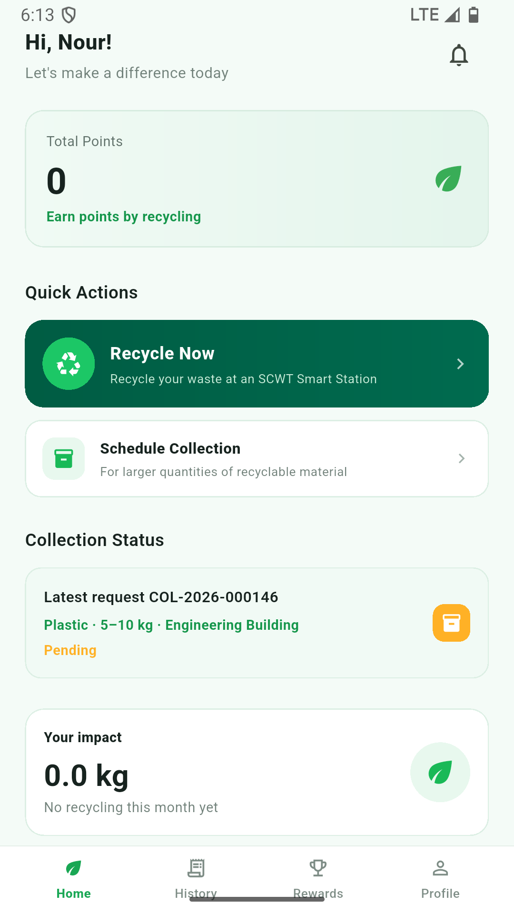 | 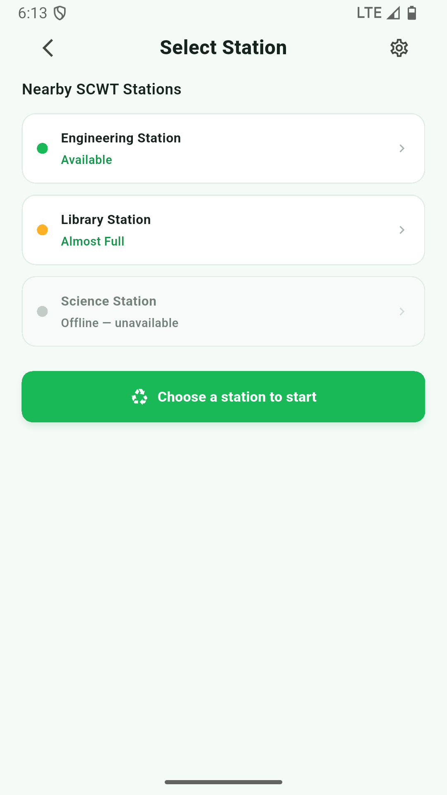 |
| 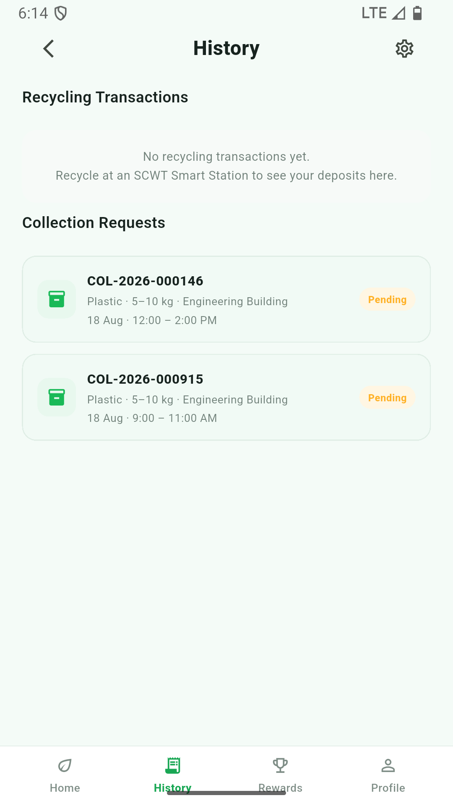 | 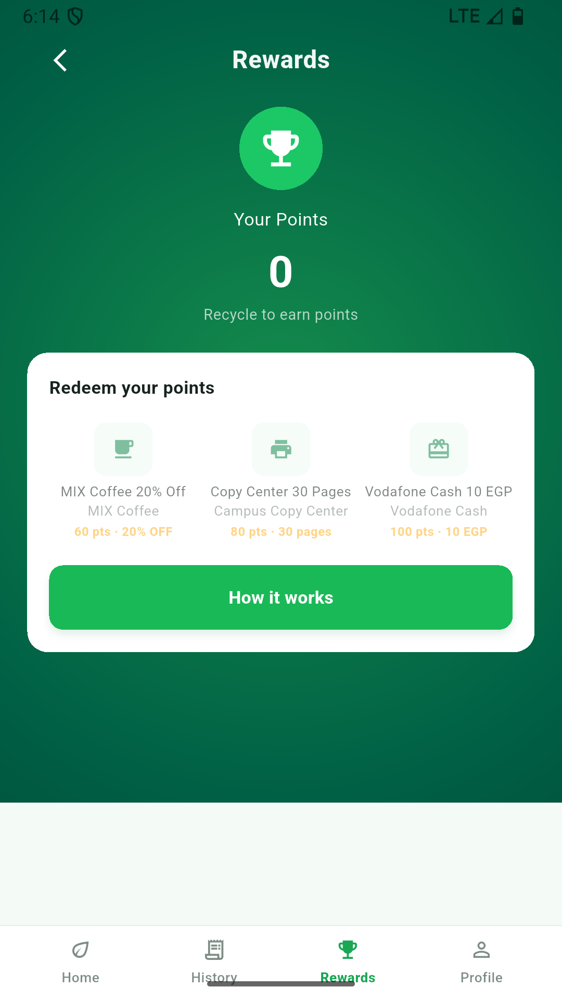 |
| 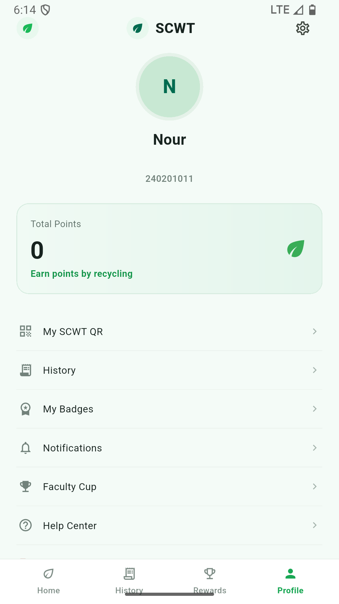 | 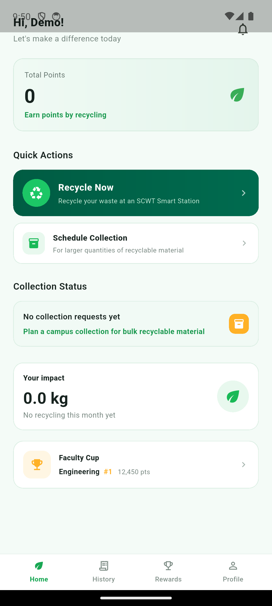 |

Web prototype on port 3000: `cd web && npm install && npm run dev`. Mobile
app: `cd mobile && flutter run`.

## Modes

- **Demo** (default): fully local app experience — local session, points,
  history, simulated deposit chain. No backend required.
- **Production**: the app talks to THIS repository's backend.

```bash
cd mobile && flutter run --dart-define=SCWT_MODE=production \
            --dart-define=API_BASE_URL=http://10.0.2.2:8100/api/v1
# release builds require https:// API_BASE_URL
```

Points authority: in production the client NEVER computes points. Balances
and history come exclusively from the backend; deposits complete only via
validated physical events on SCWT's own MQTT infrastructure.

## Run the full stack

```bash
scripts/dev_up.sh                        # real stack: broker + AI + backend
scripts/dev_health.sh                    # honest health verification
docker compose -f infra/docker-compose.yml up --build   # or containerised
python scripts/e2e_carriage_chain.py     # live full-chain proof
```

## Develop & test

```bash
cd mobile && flutter pub get && flutter analyze && flutter test
flutter build apk --release

cd backend    && pip install -r requirements.txt && alembic upgrade head && pytest
cd ai-service && pip install -r requirements.txt -r requirements-training.txt && pytest
cd hardware-simulator && pytest
pio run -d firmware/carriage-v1
```

Ports are owned by this project (8100 / 8052 / 1886 · PostgreSQL 55432) so it
can run side by side with any other software on the same machine.

## Status & Known Limitations

- **Standalone product**: SCWT runs with no dependency on any other project's
  source or services.
- **`web/` is a UI prototype**: browse/login screens only — not wired to the
  backend API or MQTT.
- **Firmware**: `firmware/carriage-v1` is a compilable skeleton for `esp32dev`
  (PlatformIO); the physical carriage station has not been field-deployed.
- **Training deps**: `ai-service` imports the training module at startup, so
  serving also needs `requirements-training.txt` (torch) — not just
  `onnxruntime`.
- Tests are green on a clean virtualenv: backend **199**, ai-service **83**
  (+4 skipped), hardware-simulator **30**.

## License

MIT — see [LICENSE](LICENSE).